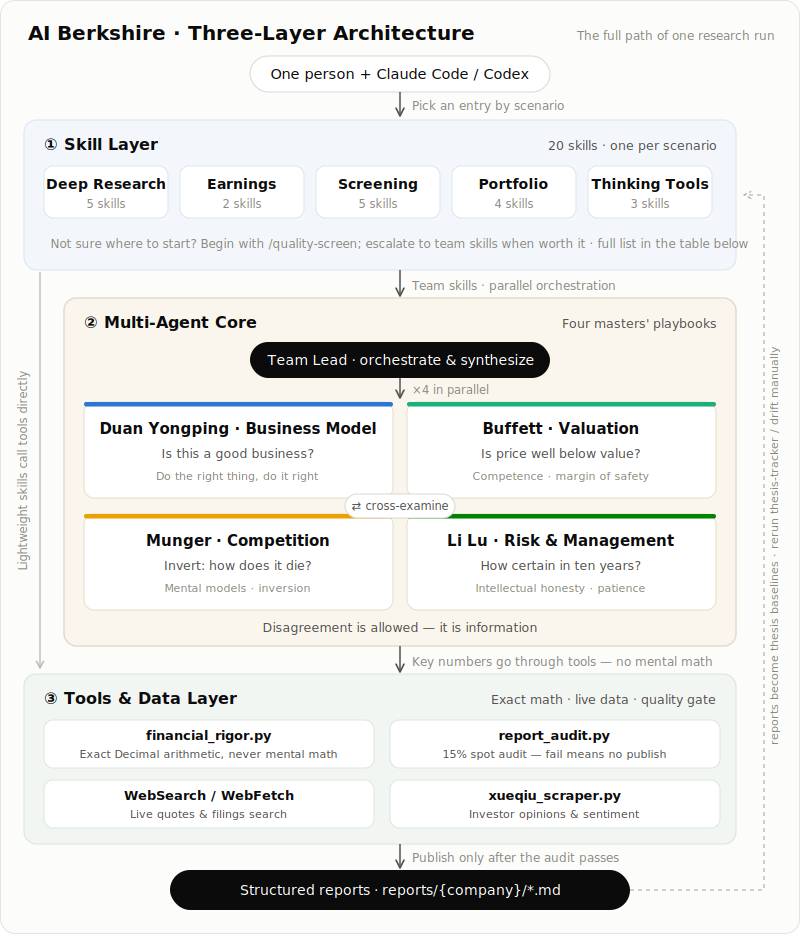

日本語 | [English](README_EN.md) | [中文](README.md)

> 日本語版はコミュニティによりメンテナンスされています。内容が最新でない場合は、中文版・英語版を正としてください。

[](https://trendshift.io/repositories/63696)

# AI Berkshire — AI時代のバリュー投資リサーチフレームワーク

> 「価格はあなたが払うもの、価値はあなたが得るもの」 — ウォーレン・バフェット
>
> AIでリサーチの深度と効率を再定義する。

**AI Berkshire** は、Claude CodeおよびCodexに対応した投資リサーチSkillのコレクションです。バフェット・マンガー・段永平（ダン・ヨンピン）・李録（リ・ルー）という4人のバリュー投資の巨人の方法論を体系化し、AIエージェントによりプロフェッショナル水準のリサーチを提供します。

1人 + Claude Code / Codex = 投資リサーチチーム丸ごと。

[実績](#実績) · [なぜAIに直接聞いてはいけないのか](#なぜaiに直接聞いてはいけないのか) · [Skill一覧](#skill一覧20スキル) · [クイックスタート](#クイックスタート) · [レポート](#実際のリサーチレポート) · [設計思想](#設計思想)

---

## 実績

> これは紙の上のシミュレーションではありません。このフレームワークは実際の資金による、監査済みポートフォリオで裏付けられています。

### 2024年通年リターン：+69.29%


### 2025年通年リターン：+66.38%


### ベンチマーク比較

| ベンチマーク | 2024年通年 | 2025年通年 |
|------------|-----------|----------|
| **本フレームワーク（実績）** | **+69.29%** | **+66.38%** |
| ハンセン指数 | +17.67% | +27.77% |
| S&P 500 | +23.31% | +16.39% |
| CSI 300 | +14.68% | +17.66% |
| NASDAQ総合 | +28.64% | +20.36% |

**2024年アルファ**：S&P 500を **46ポイント** 上回り、ハンセン指数を **52ポイント** 上回る

**2025年アルファ**：S&P 500を **50ポイント** 上回り、ハンセン指数を **39ポイント** 上回る

**2年間の累計実績リターンは146万元超**、2年連続で主要グローバル指数を大幅にアウトパフォーム。

> *免責事項：過去の実績は将来の結果を保証するものではありません。スクリーンショットは実際の証券口座（富途証券）のものです。*

---

## なぜAIに直接聞いてはいけないのか？

「拼多多（ピンドゥオドゥオ）は買いですか？」とClaudeに聞くことはできます。すると「一方では...他方では...」とバランスの取れた分析が返ってきて、「投資にはリスクが伴います、ご自身の判断でご検討ください」と締め括られます。

**そういう分析は正しそうに見えても、実際の意思決定には使えません。**

AI Berkshireが解決するのは「AIは分析できるか？」という問題ではなく、**分析の質と意思決定の規律**という問題です。何が違うのかを説明します。

### 1. 判定を強制する——曖昧さを許さない

AIに直接聞けば、どちらにも都合の良い「分析」が返ってきます。AI Berkshireは具体的なアウトプットを強制します：**合格 / 不合格 / グレーゾーン**、具体的な価格帯と段階的な推奨付きで。

> AIへの素朴な質問への回答：*「拼多多には成長ポテンシャルがありますが、競争圧力も存在します。投資家は...」*
>
> AI Berkshireの出力：

> | 戦略 | 推奨 | 価格帯 |
> |------|------|--------|
> | アグレッシブ | 現在値で20%ポジション構築 | $95–105 |
> | モデレート | バイバック方針明確化を待つ | $85–95 |
> | コンサバティブ | 10年間の確実性基準を満たさない——パス | — |
>
> **ミラーテスト**：5文で説明できなければ = 買わない。例外なし。

### 2. 4人の巨人による弁証法——単一視点ではなく

「バフェットの手法でこれを分析して」ではありません。4つの視点は**本物の緊張と矛盾**を生み出します——

拼多多を例に：
- **段永平**（ビジネスモデル）：優れたビジネス、C2Mモデルは複製困難 → 3.7/5
- **バフェット**（財務・バリュエーション）：現金除きPERはわずか6.3倍、キャッシュマシン → 4.4/5
- **マンガー**（逆説的思考）：見かけよりモートは浅い——抖音（ドウイン）は3年でGMV4兆元に到達 → 3.5/5
- **李録**（長期確実性）：マネジメント文化に懸念、10年後は不確実 → 2.0/5

**バフェットは「本当に安い」と言い、李録は「不確実なら買うな」と言う**——この衝突こそが投資判断の実像です。単一プロンプトではこのような多視点の弁証法は生まれず、だからこそブラインドスポットを防ぎます。

### 3. 構造化されたバイアス対抗メカニズム

AIの最大の危険は誤った答えを出すことではなく、**正しそうに見えるが精査に耐えない**答えを出すことです。AI Berkshireはプロセスに複数の「欺瞞防止」レイヤーを組み込んでいます：

| メカニズム | 解決する問題 | 例 |
|-----------|------------|-----|
| **情報リッチネス評価（A/B/C）** | 「データが多い＝確実性が高い」という幻想を防ぐ | 泡泡玛特（ポップマート）はB評価：データ限定、推定値は信頼度付きでフラグ |
| **マンガー式逆説テスト** | 失敗シナリオを強制的に考えさせる | 「拼多多はどうすれば潰れるか？」→ 確率付き5シナリオをリスト |
| **即死チェックリスト** | 8つのレッドライン、1つでも該当すれば拒否 | マネジメントの誠実性に問題 → バリュエーションに関わらず即座に却下 |
| **逆張りチェック** | 群衆と同じ考え方を避ける | 「なぜ賢い人がこれをショートしているのか？」→ 見落とされたリスクを浮かび上がらせる |
| **知的誠実さ** | 「分からない」を優先 | データのギャップは「グレーゾーン」と明記、推測で確実性を埋めない |

### 4. 財務データの精度

LLMは暗算が信頼できません。PERを1桁間違えたり、香港ドルと人民元を混同したりすることで、壊滅的な投資判断につながる可能性があります。

**実例**：テンセント分析時、異なるソースが「香港ドル10億単位」と「人民元10億単位」で時価総額を報告していた。AI Berkshireのアプローチ：

```bash
# 時価総額の手動検証：株価 × 発行済株式数、報告データと照合
python3 tools/financial_rigor.py verify-market-cap \
  --price 510 --shares 9.11e9 --reported 4.65e12 --currency HKD
# ✅ 検証済み — 乖離はわずか0.08%
```

すべての計算はPython `decimal.Decimal`（厳密な10進算術）を使用し、`float`は使いません。重要データは最低2つの独立したソースによるクロスバリデーションが必要です。

### 5. 再現可能なリサーチプロセス

AIに直接聞くと、毎回フォーマット・深度・カバレッジが異なります——今日のテンセント分析にはモートスコアがあっても、明日の美団（メイトゥアン）分析では忘れられているかもしれません。

AI Berkshireが保証するのは：**同じインプット → 構造的に一貫した、均等な深度のアウトプット**。これにより：
- 同一の採点基準で7社を並べて比較できる
- 同じ会社を6か月後に再分析し、変化を直接比較できる
- チームメンバー間でリサーチアウトプットを揃えられる

> 実際のアウトプット——同一チェックリストで7社をスクリーニング：
>
> | 企業 | 判定 | 能力の輪 | 優れたビジネス | モート | マネジメント | 安全マージン | 総合 |
> |------|:---:|:------:|:----------:|:----:|:----------:|:---------:|:---:|
> | 貴州茅台 | ✅ 合格 | ★★★★★ | ★★★★★ | ★★★★★ | ★★★☆☆ | ★★★★☆ | 4.7 |
> | テンセント | ✅ 合格 | ★★★★☆ | ★★★★★ | ★★★★★ | ★★★★★ | ★★★★☆ | 4.7 |
> | NVIDIA | ✅ 条件付き | ★★★★☆ | ★★★★★ | ★★★★★ | ★★★★★ | ★★★☆☆ | 4.3 |
> | 美団 | ✅ 条件付き | ★★★★☆ | ★★★★☆ | ★★★★☆ | ★★★★☆ | ★★★★☆ | 4.0 |
> | 快手 | ✅ 条件付き | ★★★☆☆ | ★★★★☆ | ★★★★☆ | ★★★★☆ | ★★★★★ | 4.0 |
> | 拼多多 | ❓ グレー | ★★★★☆ | ★★★★☆ | ★★★☆☆ | ★★★☆☆ | ★★★★★ | 3.8 |
> | 泡泡玛特 | ❓ グレー | ★★★☆☆ | ★★★★☆ | ★★★★☆ | ★★★★★ | ★★★☆☆ | 3.7 |

### 6. マルチエージェント並列処理 = リサーチ深度の掛け算

`/investment-team` は4つの独立したエージェントを**同時に**起動して1社をリサーチします。各エージェントは独自のウェブ検索を行い、データをクロスバリデーションし、独立した結論に至ります。これは1つのプロンプトを4つのセクションに分けているのではなく、4人の「アナリスト」がそれぞれ完全なリサーチを行い、チームリードが最終判断をまとめています。

AIに直接聞けばコンテキストウィンドウは1つです。4つの並列エージェントは4倍の検索量、4倍の情報源、4つの独立した視点を意味します。

<p align="center">
  
</p>

### 一言で言えば

> **普通のユーザーがAIに聞けば「正しそうな分析」が返ってきます。AI Berkshireなら「実際に意思決定に使えるリサーチレポート」が得られます。**

---

## アーキテクチャ

<p align="center">
  
</p>


**3層設計の思想**：
- **Skill層**：「やりたいこと」を20の明確なエントリーポイントに抽象化——深掘りリサーチ、決算分析、業界スクリーニング、ポートフォリオ管理、思考ツール。シナリオ別に選択。
- **エージェント層**：チーム型Skill（`/investment-team`、`/earnings-team`など）はチームリードの下で4人の巨匠視点エージェントを並列実行——独立して検索・判断し、互いに反論し、最後に統合。軽量Skillはこの層を通らず、ツールを直接呼び出す。
- **ツール層**：精密計算、リアルタイムウェブ検索、レポート監査——すべてのレポートのデータが厳密かつ検証可能であることを保証。

---

## Skill一覧（20スキル）

### 🔬 深掘りリサーチ

| Skill | 目的 | 使用場面 |
|-------|------|---------|
| [`/investment-research`](skills/investment-research.md) | 四巨人総合分析 | 上場企業の全方位リサーチ |
| [`/investment-team`](skills/investment-team.md) | マルチエージェント並列リサーチチーム | 4エージェント並列——最速かつ最も網羅的 |
| [`/management-deep-dive`](skills/management-deep-dive.md) | 経営陣の深掘り | 「株を買うことは人を買うこと」——経営陣が鍵となる変数のとき |
| [`/private-company-research`](skills/private-company-research.md) | 非上場企業リサーチ | アントグループ、SpaceXのような情報の少ない非上場企業のリサーチ |
| [`/deep-company-series`](skills/deep-company-series.md) | 8部構成の長編深掘りシリーズ | 発行品質のシリーズ、認知リセットから意思決定収束まで約12万字 |

### 📊 決算分析

| Skill | 目的 | 使用場面 |
|-------|------|---------|
| [`/earnings-review`](skills/earnings-review.md) | 決算の深読み（一次資料） | バフェットが有報を読むように——セルサイドレポートを読まずに生の開示書類のみを読む |
| [`/earnings-team`](skills/earnings-team.md) | 決算チーム＋発行可能な記事 | 四巨人が並列で決算を解釈 → 編集仕上げ → 読者レビュー → 発行可能状態 |

### 🏭 業界スクリーニング

| Skill | 目的 | 使用場面 |
|-------|------|---------|
| [`/industry-research`](skills/industry-research.md) | 業界バリューチェーンスキャン | ある業界のバリューチェーン全体の投資機会をマッピング |
| [`/industry-funnel`](skills/industry-funnel.md) | 業界ファネルスクリーニング | 全市場 → 粗選り≤10社 → 最終選定3社、深掘り分析付き |
| [`/quality-screen`](skills/quality-screen.md) | クオリティスクリーン（7つの厳格指標） | 一流でない企業を素早く排除；個別銘柄 / 業界 / 指数 / テーマのバッチスクリーニングに対応 |
| [`/bottleneck-hunter`](skills/bottleneck-hunter.md) | サプライチェーンボトルネックハンター | 大きなトレンドから物理的なサプライチェーンのボトルネックと裁定機会を探す |
| [`/investment-checklist`](skills/investment-checklist.md) | バフェット購入前チェックリスト | 6つのゲート、10分で深掘りする価値があるかを判断 |

### 📈 ポートフォリオ管理

| Skill | 目的 | 使用場面 |
|-------|------|---------|
| [`/portfolio-review`](skills/portfolio-review.md) | ポートフォリオレビュー＆最適化 | 「企業をリサーチする」から「ポートフォリオを管理する」へ——ポジションサイジング、集中度、リバランス |
| [`/thesis-tracker`](skills/thesis-tracker.md) | 投資テーゼトラッカー | 購入後の規律システム：投資テーゼが否定されていないかを継続的に追跡 |
| [`/thesis-drift`](skills/thesis-drift.md) | 投資テーゼのドリフト検出 | 2つのテーゼ／レポートを比較し、事実の変化・バリュエーションの変化・表現の変化を区別 |
| [`/news-pulse`](skills/news-pulse.md) | 株価変動の迅速な要因分析 | 株が急騰・急落したとき——10分で「何が起きたか」を解明 |
| [`/technical-analysis`](skills/technical-analysis.md) | 任意シンボルのテクニカル分析 | 株式、ETF、指数、先物、FX、暗号資産のマルチタイムフレーム分析と重要水準 |

### 🧠 思考ツール

| Skill | 目的 | 使用場面 |
|-------|------|---------|
| [`/dyp-ask`](skills/dyp-ask.md) | 段永平Q&A | 段永平の思考方法で任意の問いを考える——ビジネス、投資、人生 |
| [`/financial-data`](skills/financial-data.md) | 財務データの取得とクロスバリデーション | 重要データが2つ以上の独立したソースから得られることを保証；1%超の乖離をアラート |
| [`/wechat-article`](skills/wechat-article.md) | WeChat記事ワークフロー | 著者・編集者・読者エージェントが協力して発行可能な記事を制作 |

---

## クイックスタート

### コストとモデル選択

深掘りリサーチ系のSkillは、設計上、複数回のリサーチパス、複数ソースの照合、マルチエージェント統合を実行するため、大量のトークンを消費することがあります。そのコストは、ビジネス品質・財務・業界構造・リスクをより網羅的にカバーするための一部です。

重大な投資判断においては、メンテナーの見解として、通常は最も強力なモデルが最良の分析ROIをもたらします；モデルコストの節約が重要な判断品質を犠牲にすべきではありません。軽量モデルはトリアージ、要約、低リスクな質問には有用ですが、モート・バリュエーション・マネジメント・リスクの統合は、モデルの能力により強く依存すると考えるべきです。

コストを抑えるには、深掘りリサーチをそのまま安くしようとする前にワークフローを調整してください：まず [`/quality-screen`](skills/quality-screen.md) で弱い企業を除外する、あるいは [`/news-pulse`](skills/news-pulse.md) で株価変動の迅速な要因分析を行う。結果が深掘りに値する場合にのみ [`/investment-research`](skills/investment-research.md) や [`/investment-team`](skills/investment-team.md) を実行してください。

### 1. AIクライアントのインストール

このリポジトリは1つの標準ワークフローを維持し、Claude Codeコマンドと Codex skillの両方を提供します。使用するクライアントをインストールしてください。

Claude Codeユーザーの場合：

```bash
npm install -g @anthropic-ai/claude-code
```

CodexユーザーでmacOS / Linuxの場合：

```bash
# macOS / Linux
curl -fsSL https://chatgpt.com/codex/install.sh | sh

# または npm を使用
npm install -g @openai/codex

# または Homebrew を使用
brew install --cask codex

# インストール確認
codex --version
```

Windowsユーザーは公式PowerShellインストーラーを使用できます：`powershell -ExecutionPolicy ByPass -c "irm https://chatgpt.com/codex/install.ps1 | iex"`

`codex --version` がバージョンを表示したら、このプロジェクトのCodex skillsのインストールに進めます。

#### 承認プロンプトを減らす

これらのSkillは多数のツール呼び出しを行い、Claude Codeはデフォルトでその都度承認を求めます。この挙動はClaude Codeのクライアント側の権限システムによるもので、本プロジェクトが変更できるリポジトリのデフォルト設定ではありません。

現在のワークフローを信頼し、信頼できる環境で実行している場合は、権限スキップモードでClaude Codeを起動できます：

```bash
claude --dangerously-skip-permissions
```

警告：このモードはClaude Codeのツール承認ガードレールを無効化します。リポジトリ・コマンド・作業ディレクトリを信頼している場合にのみ使用してください。

### 2. Skillのインストール

Claude CodeユーザーでmacOS / Linuxの場合：

```bash
# リポジトリをクローン
git clone https://github.com/xbtlin/ai-berkshire.git

# skillをClaude Codeグローバルコマンドディレクトリにコピー
cd ai-berkshire
./scripts/install-claude-commands.sh
```

Claude CodeユーザーでWindows PowerShell / コマンドプロンプトの場合：

```bat
git clone https://github.com/xbtlin/ai-berkshire.git
cd ai-berkshire
.\scripts\install-claude-commands.bat
```

CodexユーザーでmacOS / Linuxの場合：

```bash
# リポジトリをクローン
git clone https://github.com/xbtlin/ai-berkshire.git

# Codex skillsを生成して ~/.codex/skills にインストール
cd ai-berkshire
./scripts/install-codex-skills.sh

# オプション：Codexスラッシュプロンプトを ~/.codex/prompts にインストール
# Claude Codeのような /investment-research エントリーポイントを使いたい場合
./scripts/install-codex-prompts.sh
```

CodexユーザーでWindows PowerShell / コマンドプロンプトの場合：

```bat
git clone https://github.com/xbtlin/ai-berkshire.git
cd ai-berkshire
.\scripts\install-codex-skills.bat

REM オプション：Codexスラッシュプロンプトをインストール
.\scripts\install-codex-prompts.bat
```

リポジトリは3つのエントリーポイントを維持しています：`skills/*.md` はClaude Codeコマンドのソース；`codex-skills/*/SKILL.md` は `scripts/sync-codex-skills.py` が `skills/*.md` から生成するCodex skillパッケージ；`codex-prompts/*.md` はオプションのCodexスラッシュプロンプト互換レイヤーです。

### 3. 使い方

Claude Codeで直接呼び出す：

```bash
# 深掘りリサーチ
/investment-research テンセント
/investment-team 美団
/management-deep-dive 王興、美団
/private-company-research SpaceX
/deep-company-series 拼多多

# 決算分析
/earnings-review テンセント 2025Q4
/earnings-team PDD 2025年次

# 業界スクリーニング
/industry-research 原子力発電
/industry-funnel AI算力
/quality-screen ハンセン指数構成銘柄
/bottleneck-hunter AIインフラ
/investment-checklist 茅台、NVIDIA、Apple

# ポートフォリオ管理
/portfolio-review テンセント30%、美団20%、茅台20%、現金30%
/thesis-tracker 拼多多
/thesis-drift 拼多多 reports/拼多多-thesis-2025Q4.md reports/拼多多-thesis-2026Q1.md
/news-pulse テンセント

# 思考ツール
/dyp-ask 拼多多の本当のモートはどこにあるか？
/wechat-article 美団
```

Codexにインストール後、Codexを再起動してskill名で参照します：

```text
investment-researchを使ってテンセントをリサーチして
earnings-reviewを使ってPDD2025年次の決算を分析して
industry-funnelを使ってAI算力をスクリーニングして
bottleneck-hunterを使ってAIインフラのボトルネックをスキャンして
thesis-driftを使って拼多多の2つの投資テーゼを比較して
wechat-articleを使って美団の投資記事を書いて
```

Codexスラッシュプロンプトをインストールした場合、Codexを再起動して`/`メニューから検索します。Codexの公式カスタムプロンプトエントリーポイントは通常 `prompts:<name>` として表示されます：

```text
/prompts:investment-research テンセント
```

---

## Skill詳細説明

### 1. `/investment-research` — 四巨人総合分析

最も徹底した単一企業の深掘りリサーチフレームワーク。7つのモジュールを順次実行：

```
データ収集 → ビジネスの本質（段永平） → モート（バフェット） → 逆説的思考（マンガー）
    → マネジメント評価（段永平＋バフェット） → 文明的トレンド（李録）
    → バリュエーション＆安全マージン
```

**主な特徴**：
- AIリサーチバイアス認識メカニズム（A/B/C情報リッチネス評価）
- 重要データのマルチソースクロスバリデーション（時価総額手動計算、2つ以上の独立したソース）
- 各巨人の「フォローアップ質問」を随所に織り込み
- 三シナリオバリュエーション（強気/基本/弱気）＋逆DCF

**アウトプット抜粋**：

> #### 総合判断メモ
>
> | 次元 | 結論 | 確信度 |
> |------|------|--------|
> | ビジネス品質（段永平） | 優秀：プラットフォームビジネス、双方向ネットワーク効果、限界コストほぼゼロ | ★★★★★ |
> | モート（バフェット） | ワイドかつ拡大中：ネットワーク効果＋スイッチングコスト＋規模の経済、三重層 | ★★★★☆ |
> | マネジメント（段永平＋バフェット） | 強力：創業者主導、優れた資本配分規律 | ★★★★☆ |
> | 最大リスク（マンガー） | 規制政策の不確実性；新事業の損失が全体利益を圧迫 | ★★★☆☆ |
> | 文明的トレンド（李録） | デジタル消費トレンドと整合しているが、「文明的パラダイムシフト」ではない | ★★★★☆ |
> | バリュエーション（バフェット＋段永平） | 現在PER18倍、歴史的中央値をわずかに下回る、控えめな安全マージン | ★★★★☆ |
>
> **段永平**：「このビジネスの本質は消費者と商人をつなぐこと——効率向上から利益を得る。優れたビジネスの特徴：ユーザーが増えれば商人が増え、商人が増えればユーザーが増える。フライホイールが回り始めれば、止めるのは非常に難しい。」
>
> **マンガー**：「逆転、常に逆転せよ——この会社が明日消えたら、ユーザーと商人はどうするか？答えが『すぐに代替品を見つける』なら、モートは十分深くない。答えが『生活が非常に不便になる』なら、それは注目に値する。」

---

### 2. `/investment-team` — マルチエージェントリサーチチーム

4つのAIエージェントを並列起動し、本物の投資リサーチチームをシミュレートします。各エージェントは独立して検索し、独立して分析し、独立した評価を提供。チームリードが最終判断をまとめます。

**アウトプット抜粋**：

> #### 一行結論
> 美団は中国ローカル生活サービスの圧倒的リーダーで、多層的なネットワーク効果モートを持つ。現在のバリュエーションは歴史的低水準——長期的な価値は大きい。押し目での積み増しを推奨。
>
> #### 四次元スコアカード
>
> | 次元 | フレームワーク | スコア | コア判断 |
> |------|-------------|-------|---------|
> | ビジネスモデル＆モート | 段永平 | ★★★★☆ | 強力な双方向ネットワーク効果；フードデリバリー＋店舗内でフライホイール形成 |
> | 財務＆バリュエーション | バフェット | ★★★★☆ | コア事業の利益率が着実に改善；バリュエーションは歴史的低水準 |
> | 業界＆競合 | マンガー | ★★★☆☆ | 抖音が店舗内ビジネスに侵入；競合環境が悪化する可能性 |
> | リスク＆マネジメント | 李録 | ★★★★☆ | 王興は卓越した戦略的ビジョンを持つが、新事業のキャッシュバーンは要監視 |
>
> **総合スコア：3.8 / 5**
>
> #### 投資推奨
>
> | 戦略 | 推奨 | 価格帯（香港ドル） |
> |------|------|-----------------|
> | アグレッシブ | 現在値で30%ポジション構築 | 120–140 |
> | モデレート | 100–110への押し目を待つ | 100–120 |
> | コンサバティブ | 四半期決算で利益率トレンド確認を待つ | <100 |

---

### 3. `/investment-checklist` — バフェット購入前チェックリスト

6つのゲートによる迅速なスクリーニング——10分で深掘りする価値があるかを判断：

```
ゲート1：能力の輪（理解できるか？）
    ↓ 通過
ゲート2：優れたビジネス（経済性はどうか？）
    ↓ 通過
ゲート3：モート（競争優位はどのくらい深いか？）
    ↓ 通過
ゲート4：マネジメント（信頼できるか？）
    ↓ 通過
ゲート5：安全マージン（価格は十分に安いか？）
    ↓ 通過
ゲート6：意思決定の規律（合理的か、FOMOか？）
    ↓ 通過
   ✅ ミラーテスト
```

**複数企業の比較に対応**——複数の対象を一度にスクリーニング：

```
/investment-checklist テンセント、アリババ、美団、拼多多
```

**アウトプット抜粋**：

> #### ミラーテスト
>
> 「私がテンセントをHK$380で買うのは：
> 1. このビジネスの本質は**ソーシャルネットワーク＋デジタルコンテンツプラットフォーム**——私は理解している；
> 2. そのモートは**12億ユーザーのソーシャルグラフ**であり、拡大中；
> 3. マネジメント——**馬化騰（ポニー・マー）は控えめで実用的、優れた資本配分者**——信頼できる；
> 4. 現在の価格は**本質的価値の約80%** を表し、意味のある安全マージンを提供；
> 5. たとえ間違っていても、下落リスクは管理可能、なぜなら**純現金は2,000億元超、ゲームのキャッシュフローは盤石だから**。」
>
> ✅ ミラーテスト通過
>
> **5文で説明できなければ = 買わない。例外なし。**

---

### 4. `/industry-research` — 業界バリューチェーンスキャン

投資テーマから出発して、業界バリューチェーンの全体研究を完成させます：

```
投資ロジックチェーン → バリューチェーンマップ → グローバル上場企業スキャン
    → セグメントリーダーへの四巨人分析 → ポートフォリオ配分推奨
```

**アウトプット抜粋**：

> #### 投資ロジックチェーン：原子力発電
>
> 根本的トレンド：AIデータセンターの電力需要爆発＋カーボンニュートラル目標
> → 推進力：安定したクリーンなベースロード電力への急増する需要
> → 生み出すもの：原子炉再稼働 / 新設 / SMRへの確実な需要
> → 恩恵：ウラン採掘 → 燃料加工 → 設備製造 → 運営会社
>
> #### 推奨ポートフォリオ
>
> | ティア | 比重 | 対象 | セグメント | コアロジック |
> |-------|------|------|---------|-----------|
> | コア | 50% | CGN / カメコ | 運営＋ウラン | 最高確実性 |
> | サテライト | 30% | 中核電力 / 東方電気 | 運営＋設備 | 国産代替受益者 |
> | オプション | 15% | NuScale / Nano Nuclear | SMR | 高リスク・高凸性 |
> | ETF | 代替 | URA / URNM | 全チェーン | パッシブアプローチ |

---

### 5. `/industry-funnel` — 業界ファネルスクリーニング

業界/テーマから出発して段階的に絞り込む：**全市場 → ≤10社 → 3社の深掘り**：

```
全市場スキャン（アクティビティ＋リターン＋時価総額上位30の和集合 → 30–60社）
    ↓ 5つのバリュー投資ハードフィルター
粗選り ≤ 10社
    ↓ 詳細分析（各300–500字）
詳細分析 ≤ 10社
    ↓ 最終選定（スコア上位3社ではなく、ポートフォリオ補完性による）
3社への四巨人深掘り分析（各800–1200字）
    ↓
推奨ポートフォリオ（コア / サテライト / オプション）＋アクションシグナル
```

**主な特徴**：
- すべての層で明確な採用/除外基準——除外された銘柄には理由が記載（ブラックボックスにしない）
- 最終3社はランキングスコアではなく**ポートフォリオ補完性**（高確実性＋適度な上昇余地＋高凸性）で選定
- 「将来のIPO候補」リスト必須、プライベートマーケットの主要プレイヤーを見逃さないため
- AIバイアス認識：大型株バイアス / 英語圏バイアス / ナラティブバイアス / 上場企業のみバイアスに対抗

**`/industry-research`との違い**：
- `industry-research`はバリューチェーン構造とパノラマビューを重視（セグメント別スライス）
- `industry-funnel`は株式選別ファネルを重視（全市場から3社への段階的スクリーニング）

**実地テスト：AIセクター、4サブトラック並列（2026-05-09）**：

| サブトラック | 最終3社 | コアポジション選定 |
|-----------|---------|----------------|
| AI算力 | TSMC / NVIDIA / SKハイニックス | TSMC ★★★★★ |
| AIモデル | アルファベット / Meta / アリババ | アルファベット ★★★★★ |
| AIアプリケーション | マイクロソフト / Adobe / AppLovin | マイクロソフト＋Adobe ★★★★ |
| AIインフラ＆電力 | イートン / 特変电工 / Talen Energy | イートン＋特変电工 ★★★★ |

**主要洞察**：AIアプリケーション層で最大の勝者は、AIネイティブ企業ではなく——流通・データ・ワークフロー組み込みを持つ既存大手です。これは1995–2000年のインターネットバブルの「ツルハシとシャベルを売れ」のパターンを反映しています（アマゾンとアップルが勝ち；Pets.comは負けた）。

完全レポート：[AI算力](reports/AI算力-funnel-20260509.md) · [AIモデル](reports/AI模型-funnel-20260509.md) · [AIアプリケーション](reports/AI应用-funnel-20260509.md) · [AIインフラ＆電力](reports/AI基建电力-funnel-20260509.md)

---

### 6. `/private-company-research` — 非上場企業深掘りリサーチ

情報の乏しい非上場企業向けに設計された「探偵型」リサーチフレームワーク：

**主な差別化点**：
- **財務データの組み立て**：IPO資料、親会社レポート、資金調達ニュース、業界データから組み立て
- **信頼度タグ付け**：すべてのデータポイントに 🟢 高 / 🟡 中 / 🔴 低の信頼度タグ
- **マルチ手法バリュエーションクロスチェック**：資金調達ラウンドバリュエーション＋比較企業＋DCF＋逆算
- **出口経路分析**：IPO / M&A / セカンダリー移転の経路を完全評価

**アウトプット抜粋**：

> #### 企業スナップショット：SpaceX
>
> | 項目 | 詳細 |
> |------|------|
> | 最新バリュエーション | 約3,500億ドル（2025年セカンダリーマーケット）🟡 |
> | 推定売上高 | 約130億ドル（2024年）🟡 |
> | Starlinkサブスクライバー数 | 400万人以上（2024年末）🟢 |
> | 打ち上げ回数 | 年間100回以上（2024年）🟢 |
>
> #### バリュエーション評価
>
> | 手法 | バリュエーション範囲 | 備考 |
> |------|-----------------|------|
> | 最新資金調達 | 3,500億ドル | セカンダリーマーケット価格；流動性プレミアム含む |
> | 比較企業 | 2,000–2,800億ドル | 通信＋航空宇宙＋防衛とのベンチマーク |
> | DCF（基本ケース） | 2,500–3,500億ドル | 2027年Starlink売上高300億ドルを仮定 |
> | 逆算 | 4,000–6,000億ドル | Starlinkがグローバル通信インフラになると仮定 |
>
> **複合フェアバリュー範囲：2,500億ドル – 4,000億ドル**

---

### 7. `/news-pulse` — 株価変動の迅速な要因分析

「株が急騰・急落したとき、何が起きたかを素早く把握する」ために設計。**深掘りリサーチではなく、10–15分の迅速な要因分析**——保有株が動いたときのパニック売りや長文の不安スパイラルを防ぎます。

**主な差別化点**：
- **4次元並列偵察**：企業イベント / 規制政策 / 業界競合 / 市場センチメント（セルサイド＋インフルエンサー＋南向き資金フロー）
- **羅列ではなく要因分析**：すべてのニュースを列挙するだけでなく、「どのイベントが実際にこの株価変動を説明するか」を判断
- **性質分類を必須化**：バリューイベント / センチメント変動 / **真の原因不明** / 混合——「真の原因不明」は最も価値あるアウトプットになることが多い（インサイダー先取りの可能性）
- **明確なアクションアイテム**：深掘りリサーチのトリガーか、テーゼの再検討か、ただ観察するかを明示

**状況別使い分け**：
| シナリオ | Skill |
|---------|-------|
| 完全なリサーチ（数時間） | `/investment-team` または `/investment-research` |
| 決算深読み | `/earnings-review` |
| 長期テーゼ追跡 | `/thesis-tracker` |
| **株価変動、10分間の要因分析** | **`/news-pulse`** |

**アウトプット抜粋**（テンセント4/17–5/01実地テスト、14日間で-10.47%）：

> #### 一行要因分析
> この-10.47%の下落の約70–80%は資金フローとセンチメントによって引き起こされた（バイバック自粛期間＋南向き売り＋セクターベータ＋AIナラティブの移行）。20–30%はAI設備投資倍増発表の遅延消化から来ている——**ファンダメンタルの悪化はない**。セルサイドコンセンサスは買い継続。これは「流動性＋センチメント主導の下落」であり、バリューイベントではない。
>
> #### 要因テーブル
>
> | 候補説明 | 推定寄与 | 確信度 |
> |---------|---------|--------|
> | バイバック自粛期間（構造的、5/13決算前） | -3%〜-4% | 高 |
> | 南向き資金がテンセントの純売り手に転換 | -2%〜-3% | 高 |
> | 競合他社にAIナラティブを奪われる（DeepSeek V4 / Qwen 3.6 / MoonDark 1T） | -1%〜-2% | 中 |
> | セクター/マクロベータ（原油＋地政学＋FRBウォーシュタカ派） | -2%〜-3% | 高 |
> | Q1決算前のリスク低減 | -1%〜-2% | 中 |
> | ファンダメンタルの悪化 | **0%** | 非常に高い（除外済み） |
>
> #### 性質分類：✅ 混合
> 70%資金フロー/センチメント ＋ 20%長期AIナラティブ懸念 ＋ 10%Q1前の不確実性
>
> **主な反証**：段永平が4/8にテンセントプットを売った（強気）；セルサイド24人のアナリストコンセンサスは強い買い；ネットイーズが4/30に逆行して2%上昇（ゲーム業界問題を除外）；テンセントがハンセンテックを7ポイント下回った（ハンセンテックは実際に月間4%上昇）。

使い方：

```
/news-pulse テンセント
/news-pulse 拼多多 1週間で-12%
/news-pulse miHoYo
```

---

## 実際のリサーチレポート

> 以下はこのフレームワークで生成された実際の投資リサーチレポートです。AI駆動リサーチの実際のアウトプット品質を示しています。

| 企業 | 使用Skill | コア結論 | レポート |
|-----|---------|---------|---------|
| 拼多多（PDD） | `/investment-team` | 総合3.4/5——極めて安いが10年の確実性は不十分；モデレートなポジションに適切 | [レポートを見る](reports/拼多多/) |
| テンセント（0700.HK） | `/investment-research` | ソーシャル独占＋優れた資本配分；先行PER14倍は妥当〜低い | [レポートを見る](reports/腾讯/) |
| 7社比較 | `/investment-checklist` | 茅台＆テンセントは合格；NVIDIA、美団＆快手は条件付き；拼多多＆泡泡玛特はグレーゾーン | [レポートを見る](reports/多公司对比-checklist-20260408.md) |
| 巨人保有銘柄トラッカー | カスタムリサーチ | バフェット / 李録 / 段永平の最新13F保有銘柄＋PDDコスト基準分析 | [レポートを見る](reports/大师持仓追踪-research-20260408.md) |

> *レポートは継続的に追加されます。このフレームワークで生成した独自のリサーチレポートを提出するPRを歓迎します。*

---

## 設計思想

### 四巨人方法論の統合

**段永平 ·「正しいビジネス」**——ビジネスの本質。残る3つの視点の共通の出発点：

| バフェット | マンガー | 李録 |
|:---:|:---:|:---:|
| モート<br>安全マージン<br>経営陣 | 逆説的思考<br>リスクリスト<br>バイアス審査 | 文明トレンド<br>パラダイムシフト<br>産業価値 |

4人の巨人は単に分業しているのではなく——**互いに挑戦し合う**ように設計されています：
- 段永平が「優れたビジネス」と言えば → マンガーは「どうすれば潰れるか？」と問う
- バフェットが「十分に安い」と言えば → 李録は「10年後も存在するか？」と問う
- 4つのレポートを貼り合わせたものではなく——4つの思考システムの衝突

### 財務精度ツール（`tools/financial_rigor.py`）

| 機能 | コマンド | 解決する問題 |
|------|---------|------------|
| **時価総額検証** | `verify-market-cap` | 株価×発行済株式数、精密計算、単位エラーを検出 |
| **バリュエーション検証** | `verify-valuation` | PER / PBR / ROE / FCFイールド——厳密な10進算術 |
| **マルチソースクロスバリデーション** | `cross-validate` | 同一データポイントをNソースで自動比較；許容範囲超でアラート |
| **三シナリオバリュエーション** | `three-scenario` | 強気/基本/弱気の正確な目標株価計算 |
| **ベンフォードの法則検出** | `benford` | 財務データの最初の桁分布の異常を検出 |
| **精度電卓** | `calc` | 任意の財務計算式を正確に計算——LLMの暗算を代替 |

**設計原則**：すべての計算はPython `decimal.Decimal`（厳密な10進数）を使用し、`float`（浮動小数点近似）は使いません。金融コンテキストで `0.1 + 0.2 = 0.3` が失敗することは絶対に許されません。

---

## 今後の方向性

- [ ] ヒストリカルバックテスト：AIリサーチレポート vs. 実際の株価パフォーマンス
- [ ] マクロ経済サイクル分析フレームワーク
- [ ] MCPを通じたリアルタイムデータフィード（Wind / Bloomberg / Yahoo Finance）

---

## 免責事項

本プロジェクトは教育・研究目的のみであり、投資アドバイスを構成するものではありません。投資にはリスクが伴います；判断は慎重に行ってください。常に自身でデューデリジェンスを行ってください（DYOR）。

---

## ライセンス

MIT License

---

> 「あなたができる最高の投資は自分自身への投資です。」 — ウォーレン・バフェット
>
> AI Berkshire：誰もが自分だけの投資リサーチチームを持てるように。

## Star履歴

このプロジェクトが役に立った方は、ぜひStarをお願いします！

[](https://star-history.com/#xbtlin/ai-berkshire&Date)
